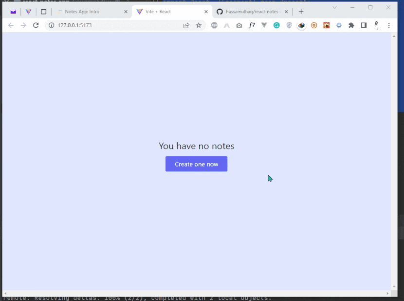
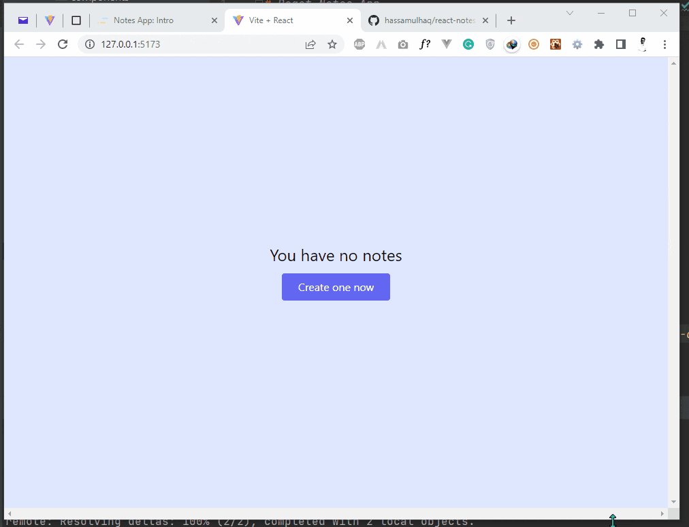

### React Notes App
___
___
___

#### Frontend Tooling
- Vitejs ^3.0.0

#### Stacks
- Reactjs ^18.2.0
- Tailwind CSS ^3.1.7

#### Dependencies
- nanoid      (to generate URL friendly unique ids)
- react-mde   (React markdown editor)
- react-split (split scrollable view)
- showdown    (preview markdown)

